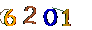

# 验证码类型1 - 不预先切图版

[Download](https://github.com/scientihark/tensorCaptcha/releases/tag/type1_nosplit.v1)

## 说明

图例  

字符包括 0-9

字数 4

包含线条混淆

### 依赖

node 依赖

```

npm i python-shell 

```

python 依赖

```

numpy

scikit-image

tensorflow

matplotlib

```

### A.直接用训练结果

可以同样处理部分数字验证码

下载训练结果

[Download](https://github.com/scientihark/tensorCaptcha/releases/tag/type1_nosplit.v1)


命令行调用 

```

magick convert [filePath] -density 300 -units PixelsPerInch -type Grayscale -negate -scale 200% -morphology Erode Octagon:1 -negate -morphology Erode disk:1 -scale 50% -threshold 99% -colors 2 -colorspace gray -background white -flatten [outputPath]

python predict.py --fname [outputPath]

```

nodejs 

```

const OCR = require('./captchaOCR.js');

OCR(`${filePath}`,(code)=>{
	// success callback
},(error)=>{
	// fail callback
})

```

### B.从头开始构建并训练

下载原始数据

[Download](https://github.com/scientihark/tensorCaptcha/releases/tag/type1.v1)


```

node makeTrainData.js

python createTrainData.py

python train.py

```

训练完成后会打印成功率

我们还提供了简单的验证程序对原始图片进行识别准确率验证


```

node checkTrainResult.js

```


## 解法思路

### 先对输入图片预处理

尽量去除线条并将图片二值化

这里偷懒没有用CV写，测试方便用了image Magic


```

magick convert [filePath] -density 300 -units PixelsPerInch -type Grayscale -negate -scale 200% -morphology Erode Octagon:1 -negate -morphology Erode disk:1 -scale 50% -threshold 99% -colors 2 -colorspace gray -background white -flatten [outputPath]

```

预处理思路

先灰度化 -> 2倍放大图像 -> 取负向 + 使用 morphology Erode Octagon:1 （去除细线） -> 再次取负向 + 使用 -morphology Erode disk:1 （尝试恢复部分原有较细的字符连接处） 

-> 缩放回原有大小 -> threshold 99% colors 2 colorspace gray background white flatten （黑白二值化）

### 生成训练数据

此验证码来源于生产环境的爬虫使用其他验证码识别方案反回的正确存档 （60W+）

我们对原图像进行上述预处理后就可以开始创建训练集了

与 [原有方案](../catpchaType1) 不同,这里不会将原图切片，直接使用tensorflow训练

### tensorflow模型

这里用的是标准的 CNN 就不赘述了

### 训练结果

训练了60W个样本

在 batchSize = 100 , 296071 个 Step 后 （公司没有购置GPU设备，所以很慢，早停了）

tensorflow 识别准确率为94.3%


